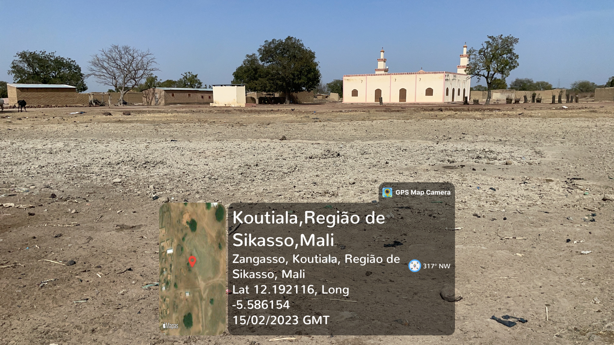

```{r setup, include=FALSE}
knitr::opts_chunk$set(echo = FALSE)

```
**Luciana Sanches, Marcelo de Carvalho Alves, and Camila Silva Franco**


## Short presentation {.unnumbered}
<div style="text-align: justify">
The Village Bandiagara II is part of the Zangasso commune in the Cercle of Koutiala in the Sikasso region of southern Mali. Basically, it is composed of desert and semi-desert areas, which has a well-defined climatic seasonality with a marked drought.

Some tribes live in the Village Bandiagara II, one of them is the Dogon of Bangadiara II. On February 15th, accompanied by a native of the tribe, we walked around the perimeter of the Dogon tribe's home in Bandiagara II, recording the route on a hiking line with GPS tracks using a Garmin Forerunner 235, such as illustrated in figure \@ref(fig:fig01a), in which the top part shows the route in the satellite layer, the left in the map layer and below the route in the elevation (m), these files were downloaded from Garmin Connect app (https://www.garmin.com/pt-BR/p/125677). And, simultaneously, we recorded georeferenced photos using the Iphone 12 mini smartphone with the GPSMapCamera app (https://gpsmapcamera.com/) installed (Illustration in figure \@ref(fig:fig01c)).
<div/>

```{r  fig01a, echo=FALSE, out.width = '100%', fig.align="center", fig.cap="Route on a hiking line, top left in satellite layer, top right in satellite layer, and below the elevation map."}

knitr::include_graphics("assets/fig1.JPG")

```

```{r  fig01c, echo=FALSE, out.width = '100%', fig.align="center", fig.cap="Illustration geotagged photograph."}



```

R software (https://www.r-project.org/) and R packages were used in this application. In general, packages: `dplyr` [@R-Wickham2021dply], `ggplot2` [@R-Wickham2020ggplot2], `leaflet` [@R-Cheng2021leaflet], `leafpop` [@R-Appelhans2021leafpop], `lubridate` [@R-Spinu2021lubridate], `purrr` [@R-Wickham2023purrr], `readr` [@R-Wickham2023readr], `sf` [@R-Pebesma2021sf], `tibble` [@R-Muller2022tibble], `tidyr` [@R-Wickham2020tidyr], `exifr` [@R-Dunnington2021exifr], and `anytime` [@R-Eddelbuettel2020anytime]. R and Rstudio enabled data processing, analysis, and also the elaboration and dissemination of this project. 

The databases of the georeferenced route and the geotagged photographs were joined and an interactive map was created. The interactive map can be accessed over the layer OpenStreetMap.France (https://www.openstreetmap.fr/) or Esri.WorldImagery (https://www.esri.com/en-us/arcgis/products/imagery-remote-sensing/capabilities/content), as examples in the figures \@ref(fig:fig01d) and \@ref(fig:fig01e).


Georeferenced photographs have the potential to recognize in fieldwork the information about relief variation, land cover and land use, interactions between residents and the RN11 road, interactions between neighboring tribes, the use of building elements and their surroundings, and finally, exploring the potential to reveal areas of interest and their underlying spatio-temporal dynamics.

The expectation of this work is to increase people's quality of life, with health and sanitation and consequently increase the development of work in the field.

-   Explore the interactive surveying in the web: [**click here**](http://www.sergeo.deg.ufla.br/webMali/webMapFotos.html)


```{r  fig01d, echo=FALSE, out.width = '100%', fig.align="center", fig.cap="Interactive web mapping illustration over the OpenStreetMap.France layer."}

knitr::include_graphics("assets/fig2.PNG")

```


```{r  fig01e, echo=FALSE, out.width = '100%', fig.align="center", fig.cap="Interactive web mapping illustration over the Esri.WorldImagery layer."}

knitr::include_graphics("assets/fig3.PNG")

```


```{r, eval=F, echo=F, include=F}

https://rstudio.github.io/distill/website.html
https://www.shinyapps.io/admin/#/dashboard # exportar site
  library(rsconnect)
  rsconnect::deployApp('D:/manuscript/Mali/geotagpres/_site')

usando github
file.create("D:/manuscript/Mali/geotagpres/_site/man.nojekyll")

https://github.com/marcelocarvalhoalves/Bangadiara.git


#aqui
https://github.com/marcelocarvalhoalves/BandiagaraII

https://yuzar-blog.netlify.app/posts/2020-12-26-how-to-create-a-blog-or-a-website-in-r-with-distill-package/#automated-continuous-publishing-deploying
  
  
library(distill)
library(usethis)


use_git()

#distill::create_website(dir = "amazing website", title = "A cool name of my Website")

usethis::use_github()

https://www.netlify.com/
  
  Link para site
      https://bandiagara2surveying.netlify.app/

```

