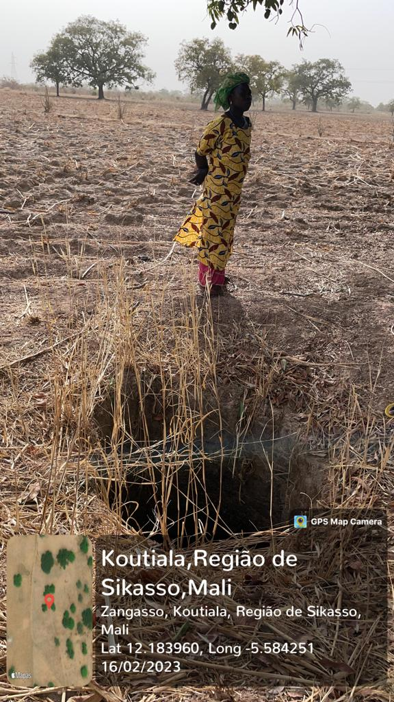

<div style="text-align: justify"> 
Some photos were obtained during the mission from the 10th to the 19th of February 2023, showing Bandiagara II, Koutiala, Mali landscape and socio-economic aspects.
  

Some georeferenced photos recorded using Iphone 12 mini smartphone with the GPSMapCamera app (Figures \@ref(fig:fig01k), \@ref(fig:fig01l), \@ref(fig:fig01m) and \@ref(fig:fig01n)).


```{r  fig01k, echo=FALSE, out.width = '60%', fig.align="center", fig.cap="Geotagged photograph illustration, groundwater water well location, Bandiagara II Village."}



```

```{r  fig01l, echo=FALSE, out.width = '60%', fig.align="center", fig.cap="Geotagged photograph illustration, old mosque view, Bandiagara II Village."}

knitr::include_graphics("assets/fig8.jpg")

```

```{r  fig01m, echo=FALSE, out.width = '100%', fig.align="center", fig.cap="Geotagged photograph illustration, location of adobe brick production area, Village Bandiagara II Village."}

knitr::include_graphics("assets/fig9.jpg")

```

```{r  fig01n, echo=FALSE, out.width = '60%', fig.align="center", fig.cap="Geotagged photograph illustration, location of cemetery, Bandiagara II Village."}

knitr::include_graphics("assets/fig10.jpg")

```


```{r setup, include=FALSE}
knitr::opts_chunk$set(echo = FALSE)
```


```{r, eval=F, echo=F, include=F}

library(slickR)

paths <- c(
  "assets/fig7.jpeg",
  "assets/fig8.jpg",
  "assets/fig9.jpg",
  "assets/fig10.jpg"
)

slickR(obj=paths)+ 
  settings(dots = TRUE)


```

